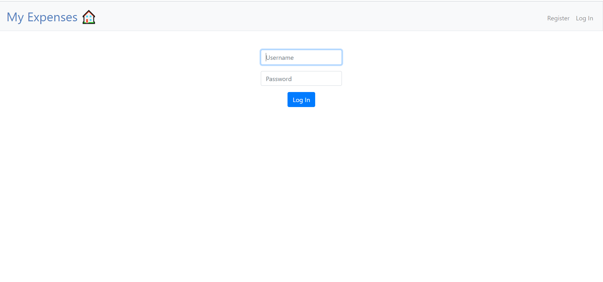
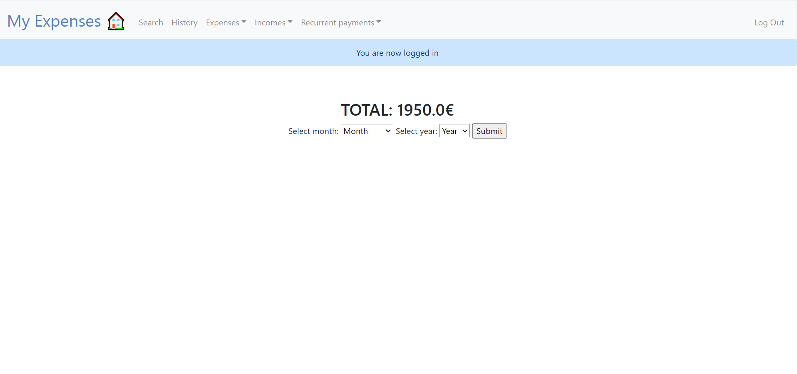
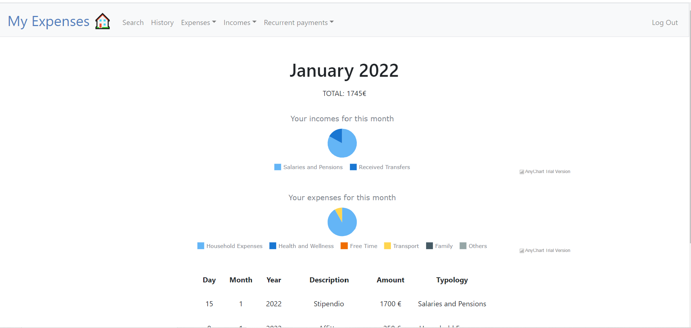
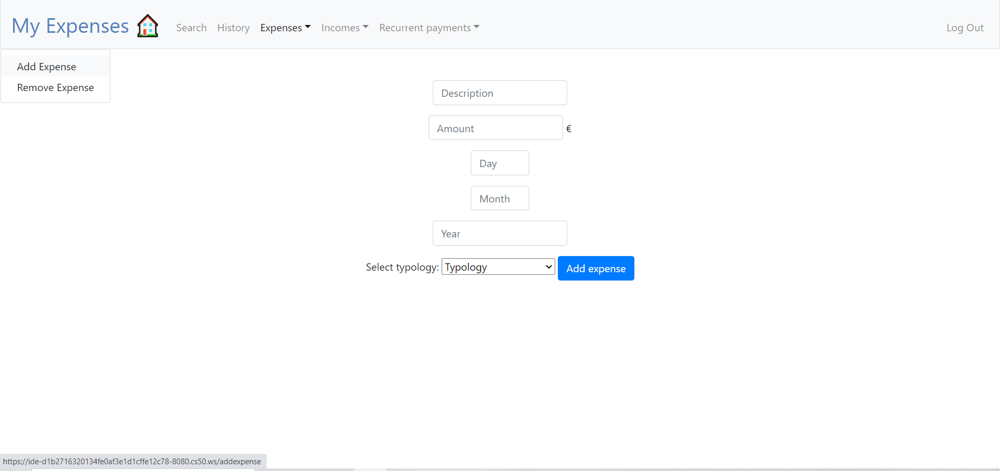
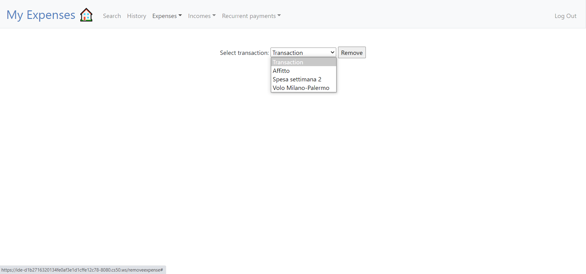
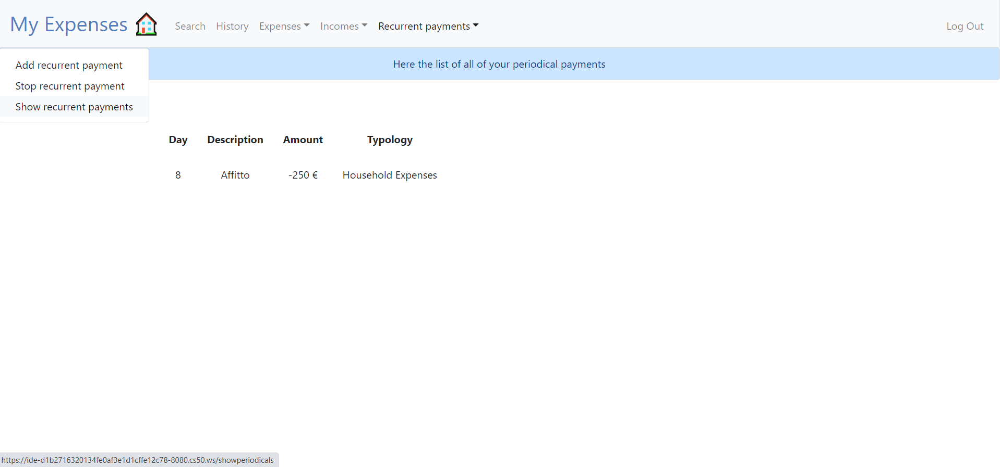

# My Expenses
#### Video Demo:  <URL https://youtu.be/cgxhnqWF0tc>
#### Developer: Solange Brugnatelli Vianini

## Description:

This project implements a former project I created over 10 years ago in Excel: a database containing all the household expenses of a person or family, and transformed it into a web application able to change and return this information.
The code I have written uses as a layout a problem set we had to write in week 9: finance. You might therefore notice some similarities between some of the pages, especially for the login, registration, the history of all transactions and the addition or removal of an income/expense.
Overall, it was fun to add and learn about new features, like adding a dynamic pie-chart or automate a transaction.

## Login and registration pages

The login page allows a user to enter their own database to view and modify their expenses and incomes.
As in pset 9, a cat appears if the user inserts the wrong password or username, or if they try to use an already existing username when registering.

## Index page

Upon logging in, the user has the choice to either see the summary of a specific month (as seen in the above picture) or to choose other options, as seen in the navbar.

Once the user chooses to review their expenses for a month (in this case, January 2022), what appears is the following:
* Two piecharts. One summarizing the expenses, grouped by typology, and the other one summarizing the incomes, grouped in the same way.
* A table showing all the expenses and incomes happened on that month

## Incomes and Expenses

On the navbar menu it is possible to choose either to add (image above) or to remove (image below) an expense or income.

## History page
This page is a simple table showing all expenses and incomes for that particular user, shown in chronological order from the most recent ones to the oldest ones.

## Search page
This page allows the user to find a particular transaction and see when it occurred.

## Recurrent Payments
This option tries to recreate the periodical payments that some people set on their bank accounts, for example when they pay their rent on the first of the month, or they have a phone contract that costs the same each month.
There are of course many improvements to this feature, and I will discuss them in the next section.

For me, the most difficult thing to implement, was how to check regularly if one of the users had a recurrent payment due.
What worked for me, in the context of a student with limited tools, was to check ALL the regular payments for all the users when the server would start. If a payment was due on that day, then an automated transaction would occur.
Also, I created a table in the database containing all the recurrent payments for all users. For each regular payment I would have an extra column called "checkdate", that would change every day upon checking that line of database. Furthermore, if that "checkdate" was the same as the "day" (on which the recurrent payment was due), then the transaction would occur.

## Possible improvements

* Design
First of all, the design of the web-pages is fairly simple and sometimes not so user-friendly.
For example, after a user logs in, the dropdown menu in the navbar appears always on the left side of the page, instead of aligning exactly below its main menu.
This has simply to do with my lack of knowledge and practice about CSS, JavaScript and HTML languages.

* Efficiency
Second, on the back-end side: the application checks every day if there are recurrent payments to be transferred. This is done on the same server used by the user, slowing-down the login and the access to the page.
This is obviously not ideal. I think one solution would be to use two different threads: one focuses on the user and the other one on the recurrent payments. Or even better, there is a thread alerting the application for every recurrent payment in the database.

* Security
Because this is a banking application, there should also be some security protection added to the entire code and especially to the database containing secret information.
With the tools I have learnt to use so far, this could be implemented by hashing most of the information inside the database.
